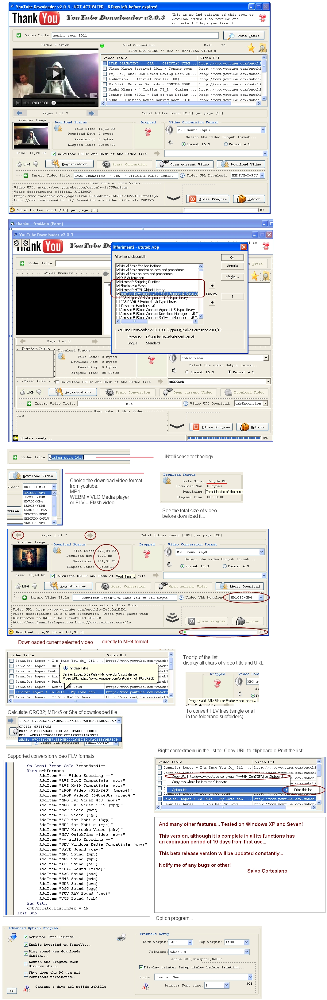



## Youtube \- Find \- Downloads and Converter v2\.0\.3b \[UPDATE on 11/19/2011\]

### Description

[Update on 11/19/2011] Simple project to Find video on Youtube.com > Download Video > and Convert [FIX and WORK]

News and Fix:

Paste direct link of youtube Video and dawnload directly (Bug Fixsed)

Search video by title and display the video Title and link (Bug Fixed)

Search by Next or Prev page's in base of the result (Bug fixed)

Correct a little bugs, now display correct link (Bug Fixed)

Calculate the CRC32; MD4/5 and Sha of video file

Choose from the URL list the download format:

MP4 -> [medium or large] 720p-1080p

FLV -> [medium, large o small] 320p-720p

WEBM (new) -> VLC Media Player format [medium or large] 720p-1080p

Opportunity to vote for the selected video style like youtube

If the video preview is not available, click on (Open in Browser) button...

You set 'Google Chrome' as the default browser, so you can see the video or download it directly .... and much more!

suggestions or other (bugs) are welcome!

Special Thanks:

Thanks to: Todd for the suggestion :)

Thanks to: Shaji for the moral support :)

P.S. If the program before the compiled exe don't start, remuve from the project the manifes file RES, recompile the exe and try it!

P.P.S. The project is in beta testing...v2.0.3 wait for future implementation THANKS!

Enjoy, and happy coding!
 
### More Info
 

             |
---                |---
**Submitted On**   |2011-11-17 07:15:44
**By**             |[Salvo Cortesiano \(Italy\)](https://github.com/Planet-Source-Code/PSCIndex/blob/master/ByAuthor/salvo-cortesiano-italy.md)
**Level**          |Advanced
**User Rating**    |4.9 (69 globes from 14 users)
**Compatibility**  |VB 6\.0
**Category**       |[Complete Applications](https://github.com/Planet-Source-Code/PSCIndex/blob/master/ByCategory/complete-applications__1-27.md)
**World**          |[Visual Basic](https://github.com/Planet-Source-Code/PSCIndex/blob/master/ByWorld/visual-basic.md)
**Archive File**   |[Youtube\_\-\_22149311192011\.zip](https://github.com/Planet-Source-Code/salvo-cortesiano-italy-youtube-find-downloads-and-converter-v2-0-3b-update-on-11-19-2011__1-73765/archive/master.zip)

